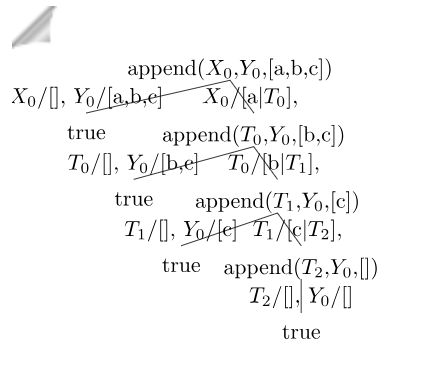
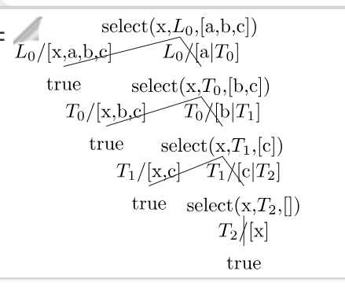

# Lista 1

Zadania: 1 (DONE, ale nie do końca), 2 (DONE, TODO: używam więcej predykatów), 3 (DONE), 4 (DONE), 5 (DONE), 6 (DONE), 7 (DONE), 8 (DONE), 9 (DONE), 10 (DONE), 11 (DONE), 12 (TODO: bez tablic)

TODO: znaleźć/zrobić toola -> draw SLD Tree prolog
https://arxiv.org/pdf/2001.08133

## Zadanie 1

Zadanie 1: Sprowadzenie negacji do postaci klauzulowej i dowód sprzeczności

https://www.cs.put.poznan.pl/jjozefowska/wyklady/loz/W11_RP_rezolucja_handouts.pdf

https://www.cs.put.poznan.pl/jjozefowska/wyklady/pdilo/pdilo5.pdf

1. (∃x (p(x)⇒ q(x)))⇒ ((∀x p(x))⇒ (∃x q(x)))
Negacja: ∃x (p(x)⇒ q(x)) ∧ ¬((∀x p(x))⇒ (∃x q(x)))
Po przekształceniu:
∃x (¬p(x) ∨ q(x)) ∧ ∀x p(x) ∧ ∀x ¬q(x)
Przenosimy kwantyfikatory:
∀a∀b∃x (¬p(x) ∨ q(x)) ∧ p(a) ∧ ¬q(b)
∀a∀b (¬p(f(a, b)) ∨ q(f(a, b))) ∧ p(a) ∧ ¬q(b)
Klauzule:
{¬p(f(a, b)) ∨ q(f(a, b))}
{¬p(a) ∨ q(a)}
{p(x)}
{¬q(x)}

2. ((∃x p(x)) ∨ (∃x q(x)))⇒ (∃x (p(x) ∨ q(x)))
Negacja: ¬(((∃x p(x)) ∨ (∃x q(x)))⇒ (∃x (p(x) ∨ q(x))))
Po przekształceniu:
(∃x p(x) ∨ ∃x q(x)) ∧ ∀x ¬(p(x) ∨ q(x))
(∃x p(x) ∨ ∃x q(x)) ∧ ∀x (¬p(x) ∧ ¬q(x))
(∃x p(x) ∨ ∃y q(y)) ∧ ∀z (¬p(z) ∧ ¬q(z))
Klauzule:
{p(a)} ∨ {q(b)}
{¬p(x), ¬q(x)}

3. (∀x p(x))⇒ (∃x p(x))
Negacja: ¬((∀x p(x))⇒ (∃x p(x)))
Po przekształceniu:
(∀x p(x)) ∧ ¬(∃x p(x))
(∀x p(x)) ∧ (∀x ¬p(x))
∀x∀y (p(x) ∧ ¬p(y))
Klauzule:
{p(x)}
{¬p(y)}

## Zadanie 2

```pl
% ?- eats(my_cat, X).
```

## Zadanie 3

```
nmwz(S) :- szczęśliwy(S), smok(S)
bottom :- smok(S), szczęśliwy(S), nmwz(S)
```

Brakujące założenia:
* "Wszystkie smoki to zwierzęta."
* "Ktokolwiek odwiedza ZOO." (TWi)
* "Wszystkie smoki są szczęśliwe." (Moje, ale obejście)


## Zadanie 4

% ?- mortal(socrates).

## Zadanie 5

A\=B :- \+ A=B

sibling TODO: jedno jest ojcem, a drugie kobieta
można jeszcze rozważać braci/siostry przyrodnie

Jeśli nie ma odcięć, to ; działa jak poniżej. Dlatego nie warto używać ;, tylko powielamy linię
```
G1; _G2 :- G1.
_G1; G2 :- G2.
```

% ?- descendant(john, mark).
% ?- descendant(X, adam).
% ?- sister(X, ivonne).
% ?- setof((X, Y), cousin(X, Y), List).

## Zadanie 6

% 1. czy istnieje bezpośrednie połączenie z Wrocławia do Lublina?
% ?- direct_connection(wroclaw, lublin).

% 2. z jakimi miastami ma Wrocław bezpośrednie połączenie?
% ?- setof(X, direct_connection(wroclaw, X), List).

% 3. z jakich miast można dojechać do Gliwic z dokładnie jedną przesiadką?
% ?- direct_connection(Y, Z), direct_connection(Z, gliwice).
% ?- findall(Y, (direct_connection(Y, Z), direct_connection(Z, gliwice)), List).
% ?- findall((Y, Z), (direct_connection(Y, Z), direct_connection(Z, gliwice)), List).

% 4. z jakich miast można dojechać do Gliwic z co najwyżej dwiema przesiadkami? Czemu niektóre miasta są wymienione więcej niż raz?
% Niektóre miasta są wymienione więcej niż raz, ponieważ wystąpiły w więcej niż jednym przypadku (0, 1, 2 przesiadki)
% 0 przesiadek LUB 1 przesiadka LUB 2 przesiadki
% findall(X, (direct_connection(X, gliwice);direct_connection(X, Y), direct_connection(Y, gliwice);direct_connection(X, Y), direct_connection(Y, Z),direct_connection(Z, gliwice)), List).
% Alternatywny sposób:
% findall(Y, (direct_connection(Y, Z), (Z = gliwice; direct_connection(Z, gliwice); direct_connection(Z, V), direct_connection(V, gliwice))), List).


% dla cyklu się zapętla
% direct_connection(1, 2).
% direct_connection(2, 3).
% direct_connection(3, 1).


## Zadanie 7

% ?- append(X, Y, [a,b,c]).



## Zadanie 8

% ?- select(x, L, [a,b,c]).




## Zadanie 9

Zadaj Prologowi następujące pytania:
1. Jakie pary list mają tę własność, że druga jest wynikiem konkatenacji dwóch kopii pierwszej z nich?
2. Jaki element należy usunąć z listy [a,b,c,d] by otrzymać listę [a,c,d]?
3. Jaką listę należy dołączyć do listy [a,b,c], by otrzymać listę [a,b,c,d,e]?

% append(X, X, Y).
concatenated_twice(X, Y).
% select(X, [a, b, c, d], [a, c, d]).
delete_element(X, [a, b, c, d], [a, c, d]).
% append([a, b, c], X, [a, b, c, d, e]).
add_to_list(X, [a, b, c], [a, b, c, d, e]).

## Zadanie 10


## Zadanie 11

% ?- s1(A, B, C, D, E, F), s2(A, B, C, D, E, F), s3(A, B, C, D, E, F), s4(A, B, C, D, E, F), s5(A, B, C, D, E, F), s6(A, B, C, D, E, F).

## Zadanie 12

TODO: to jest na necie

% Einstein's Riddle
% A formulation of Einstein's Riddle (aka Zebra Puzzle) in Prolog as appeared on Life International magazine 17/12/1962
% Source: https://en.wikipedia.org/wiki/Zebra_Puzzle

% Modelling the problem:
% - Each house is represented by the predicate house/5
% - The five houses are modelled as a(n) (ordered) list of house(Color, Nationality, Pet, Drink, Cigarette) in the variable Houses
% - The predicate solve/2 for solving the riddle is of the form solve(WaterDrinker, ZebraOwner) where WaterDrinker is the nationality of the person who drinks water and ZebraOwner the nationality of the person owning a zebra as a pet

% Expected solution: if the problem is modelled correctly by this program then the only solution set should be:
% WaterDrinker = norwegian, ZebraOwner = japanese.


% adjacent/3 - A helper function for expressing the "directly next to" relation in a list
% adjacent(A, B, List) means that either A is directly left of B in List or A is directly right of B in List
adjacent(A, B, List) :- nextto(A, B, List); nextto(B, A, List).

% solve/2 - The main predicate for solving the puzzle
solve(WaterDrinker, ZebraOwner) :-
  length(Houses, 5),                                                          % 1. There are five houses.
  member(house(red, english, _, _, _), Houses),                               % 2. The Englishman lives in the red house.
  member(house(_, spanish, dog, _, _), Houses),                               % 3. The Spaniard owns the dog.
  member(house(green, _, _, coffee, _), Houses),                              % 4. Coffee is drunk in the green house.
  member(house(_, ukrainian, _, tea, _), Houses),                             % 5. The Ukrainian drinks tea.
  nextto(house(ivory, _, _, _, _), house(green, _, _, _, _), Houses),         % 6. The green house is immediately to the right of the ivory house.
  member(house(_, _, snail, _, old_gold), Houses),                            % 7. The Old Gold smoker owns snails.
  member(house(yellow, _, _, _, kools), Houses),                              % 8. Kools are smoked in the yellow house.
  nth1(3, Houses, house(_, _, _, milk, _)),                                   % 9. Milk is drunk in the middle house.
  nth1(1, Houses, house(_, norwegian, _, _, _)),                              % 10. The Norwegian lives in the first house.
  adjacent(house(_, _, _, _, chesterfields), house(_, _, fox, _, _), Houses), % 11. The man who smokes Chesterfields lives in the house next to the man with the fox.
  adjacent(house(_, _, _, _, kools), house(_, _, horse, _, _), Houses),       % 12. Kools are smoked in the house next to the house where the horse is kept.
  member(house(_, _, _, orange_juice, lucky_strike), Houses),                 % 13. The Lucky Strike smoker drinks orange juice.
  member(house(_, japanese, _, _, parliaments), Houses),                      % 14. The Japanese smokes Parliaments.
  adjacent(house(_, norwegian, _, _, _), house(blue, _, _, _, _), Houses),    % 15. The Norwegian lives next to the blue house
  member(house(_, WaterDrinker, _, water, _), Houses),                        % Who (WaterDrinker) drinks water?
  member(house(_, ZebraOwner, zebra, _, _), Houses).                          % Who (ZebraOwner) owns the zebra?
