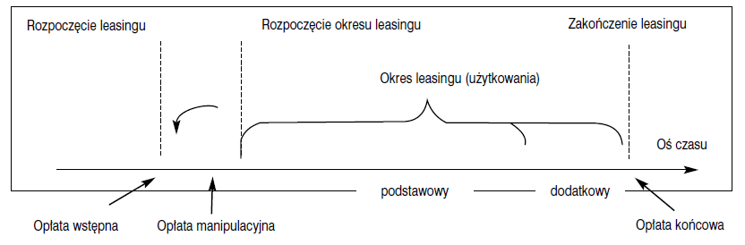
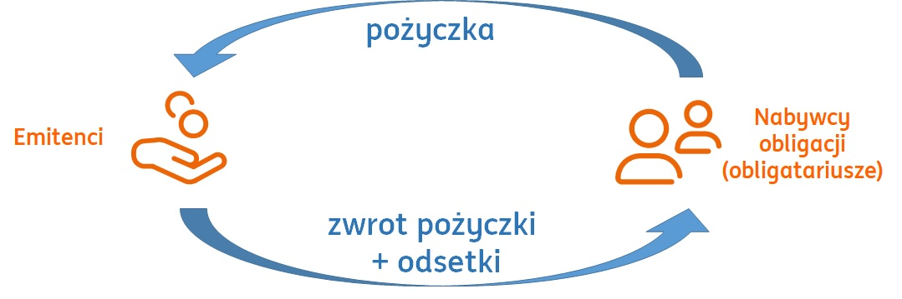

# Kolokwium 2

* [Kolokwium 2](#kolokwium-2)
	* [Leasing](#leasing)
		* [Przykłady Banków, Które Mają Opcję Leasingu (TODO:)](#przykłady-banków-które-mają-opcję-leasingu-todo)
		* [Rodzaje Leasingu:](#rodzaje-leasingu)
		* [Charakterystyka i Porównanie Rodzajów Leasingu:](#charakterystyka-i-porównanie-rodzajów-leasingu)
		* [Różnice Rodzajów Leasingu:](#różnice-rodzajów-leasingu)
		* [Rodzaje Opłat](#rodzaje-opłat)
	* [Leasing Konsumencki](#leasing-konsumencki)
		* [Leasing Konsumencki - Samochód](#leasing-konsumencki---samochód)
		* [Leasing Konsumencki vs Kredyt Konsumencki](#leasing-konsumencki-vs-kredyt-konsumencki)
	* [Kredyty dla przedsiębiorstw, klientów korporacyjnych](#kredyty-dla-przedsiębiorstw-klientów-korporacyjnych)
		* [Kredyt w rachunku bieżącym](#kredyt-w-rachunku-bieżącym)
		* [Kredyt w rachunku kredytowym](#kredyt-w-rachunku-kredytowym)
			* [Kredyt Płatniczy](#kredyt-płatniczy)
			* [Kredyt Rewolwingowy](#kredyt-rewolwingowy)
		* [Kredyt Inwestycyjny - Finansowanie Długoterminowe](#kredyt-inwestycyjny---finansowanie-długoterminowe)
			* [Ile otrzymamy kredytu?](#ile-otrzymamy-kredytu)
			* [Ile wkładu własnego?](#ile-wkładu-własnego)
	* [Usługi Inwestycyjne](#usługi-inwestycyjne)
		* [Firma inwestycyjna](#firma-inwestycyjna)
	* [Usługi Maklerskie](#usługi-maklerskie)
	* [Instrument finansowy](#instrument-finansowy)
		* [Papiery wartościowe](#papiery-wartościowe)
			* [Akcje](#akcje)
				* [Dywidenda](#dywidenda)
			* [Jak Nabywać Akcje?](#jak-nabywać-akcje)
			* [Cena Akcji](#cena-akcji)
			* [Ryzyko akcji (TODO: )](#ryzyko-akcji-todo-)
			* [Akcje – Premia Za Ryzyko](#akcje--premia-za-ryzyko)
			* [Obligacje](#obligacje)
				* [Podział/rodzaje obligacji (TODO: ):](#podziałrodzaje-obligacji-todo-)
			* [Obligacje - Notowania i Cena](#obligacje---notowania-i-cena)
			* [Obligacje - Ryzyko Stóp Procentowych](#obligacje---ryzyko-stóp-procentowych)
			* [Instrumenty Pochodne - Derywaty](#instrumenty-pochodne---derywaty)
			* [MiFID – Czyli Ochorna Klienta- Inwestora](#mifid--czyli-ochorna-klienta--inwestora)
			* [MiFID – Co Powinna Zrobić Każda Firma Inwestycyjna?](#mifid--co-powinna-zrobić-każda-firma-inwestycyjna)
			* [MiFID – Czyli Ochorna Klienta- Inwestora](#mifid--czyli-ochorna-klienta--inwestora-1)
	* [Usługi Płatnicze - Usługi Rozliczeniowe Dla Klientów Detalicznych i Korporacyjnych](#usługi-płatnicze---usługi-rozliczeniowe-dla-klientów-detalicznych-i-korporacyjnych)
		* [Usługi Rozliczeniowe](#usługi-rozliczeniowe)
		* [Usługa Płatnicza](#usługa-płatnicza)
		* [Transakcja Płatnicza](#transakcja-płatnicza)
	* [Obłsuga i Realizacja Transakcji Płatniczych Gotówkowych](#obłsuga-i-realizacja-transakcji-płatniczych-gotówkowych)
		* [Rozliczenia Gotówkowe](#rozliczenia-gotówkowe)
		* [Wpłaty Gotówkowe](#wpłaty-gotówkowe)
		* [Transakcje Bezgotówkowe](#transakcje-bezgotówkowe)
			* [Polecenie Przelewu](#polecenie-przelewu)
			* [POLECENIE PRZELEWU- DEFINICJA Z UPP](#polecenie-przelewu--definicja-z-upp)
			* [POLECENIE PRZELEWU](#polecenie-przelewu-1)
		* [Rachunki Zastrzeżone](#rachunki-zastrzeżone)
		* [Obsługa i Realizacja Transakcji Płatniczych Walutowych](#obsługa-i-realizacja-transakcji-płatniczych-walutowych)
			* [Polecenie Przelewu w Walucie Obcej](#polecenie-przelewu-w-walucie-obcej)
			* [Przelewy Zagraniczne](#przelewy-zagraniczne)
			* [Kod SWIFT (zwany kodem BIC)](#kod-swiftzwany-kodem-bic)
			* [Przelew SEPA](#przelew-sepa)
			* [Przelew Zagraniczny- Klienci Korporacyjni](#przelew-zagraniczny--klienci-korporacyjni)
	* [Nieprawidłowości - Usługi płatnicze](#nieprawidłowości---usługi-płatnicze)
		* [Manipulacje i nadużycia na rynku finansowym](#manipulacje-i-nadużycia-na-rynku-finansowym)

## Leasing

Co to jest leasing?
Dla kogo jest ta usługa?
Kto może udzielać leasingu?

* To forma finansowania „obcego”. Dlaczego?
* Leasing to bardzo popularny sposób finansowania działalności gospodarczej
* **Odmiennie definiowany i traktowany przez przepisy podatkowe i rachunkowe**

**Umowa leasingu**

Poprzez umowę leasingu należy rozumieć umowę nazwaną w kodeksie cywilnym oraz każdą inną umowę, na mocy której **jedna ze stron (finansujący) oddaje do odpłatnego używania na warunkach określonych w ustawie, drugiej stronie (korzystający), podlegające amortyzacji środki trwałe, wartości niematerialne i prawne oraz grunty**.

**Leasing**

* Jest instrumentem zaspokajającym potrzeby przedsiębiorstwa (korporacji) w zakresie finansowania nakładów inwestycyjnych.
* Jest on usługą polegającą na dostarczeniu przez **finansującego (leasingodawcę) korzystającemu (leasingobiorcy) ustalonego w umowie środka trwałego**, np. elementu wyposażenia, obejmującego sprzęt informatyczny, maszyny biurowe, maszyny i urządzenia produkcyjne, pojazdy mechaniczne
* Korzystający zobowiązuje się natomiast do płacenia określonej opłaty leasingowej rozłożonej na raty.

### Przykłady Banków, Które Mają Opcję Leasingu (TODO:)

* MBank Leasing
* Idea Getin Leasing
* Millennium Leasing
* PKO Leasing
* Alior Leasing
* Santander Leasing
* CA EFL Grupa Credit Agricole (???)

Zazwyczaj są to spółki-córki (spółki zależne) banków i mają nazwę postaci: `NAZWA_BANKU` + `"Leasing"`
W takich spółkach dany bank ma większość udziałów (ponad 50% udziałów)

### Rodzaje Leasingu:

* **operacyjny** - Obejmuje on przedmioty, które mogą być ponownie, po zakończeniu trwania umowy, oddane w leasing kolejnym użytkownikom. Po okresie umowy następuje powrót przedmiotu leasingu do jego właściciela – finansującego (leasingodawcy)
* **finansowy** - Cechuje wieloletni okres trwania i jest związany z reguły z całkowitą amortyzacją przedmiotu leasingu. Korzystający (leasingobiorca) przez cały okres trwania umowy ponosi bieżące koszty utrzymania przedmiotu, a po jego zakończeniu prawo własności rzeczy przechodzi na niego z mocy umowy

### Charakterystyka i Porównanie Rodzajów Leasingu:

|                                                                                                                                                                                                          Leasing Operacyjny                                                                                                                                                                                                           |                                                                                                                                                     Leasing Finansowy                                                                                                                                                      |
| :-----------------------------------------------------------------------------------------------------------------------------------------------------------------------------------------------------------------------------------------------------------------------------------------------------------------------------------------------------------------------------------------------------------------------------------: | :------------------------------------------------------------------------------------------------------------------------------------------------------------------------------------------------------------------------------------------------------------------------------------------------------------------------: |
| zawieranie umów na krótki czas w porównaniu z czasem trwania ekonomicznego zużycia obiektu (finansujący nie może zakładać, że pojedyncza umowa leasingowa pokryje amortyzację przedmiotu tej umowy, tj. pokryje koszty jego nabycia lub wytworzenia, oprocentowania i odpowiednich bieżących kosztów administracyjnych, ponieważ amortyzacja odbywa się w wyniku całego łańcucha kolejnych, następujących po sobie umów leasingowych) |                                                                                           brak możliwości wypowiedzenia umowy przez każdą ze stron podczas „okresu bazowego”, stanowiącego 60–80% czasu zużycia przedmiotu umowy                                                                                           |
|                                                                                                                                           koszty amortyzacji, remontów obiektu, konserwacji oraz podatków i ubezpieczeń, które towarzyszą eksploatacji obiektu, ponosi z reguły finansujący                                                                                                                                           |                                                                                                                               świadczenie przez finansującego dodatkowych usług serwisowych                                                                                                                                |
|                                                                                                                                                     stroną stale ponoszącą ryzyko jest finansujący (zwłaszcza ryzyko kradzieży, przypadkowego zniszczenia, defektów technicznych)                                                                                                                                                     | fakt ponoszenia kosztów remontu, konserwacji obiektu itp. przez użytkownika -> pełna amortyzacja obiektu na podstawie pojedynczej umowy leasingowej (koszty oprocentowania oraz administracyjne finansującego w pełni pokrywają raty leasingowe oraz jednorazowe wpłaty dokonywane na początku i na końcu okresu leasingu) |
|                                                                                                                           wyżej wymienione cechy skłaniają często finansującego do stawiania (przekazując w użytkowanie obiekt) warunku świadczenia również usług w postaci bieżących napraw i konserwacji                                                                                                                            |                                                                  fakt przeniesienia ryzyka związanego z wykorzystywaniem przedmiotu leasingu na korzystającego (także zobowiązanie do pokrywania kosztów rozmaitych ubezpieczeń, usuwania defektów itp.)                                                                   |

### Różnice Rodzajów Leasingu:

|           Cecha           |                                Leasing Operacyjny                                 |                                Leasing Finansowy                                 |
| :-----------------------: | :-------------------------------------------------------------------------------: | :------------------------------------------------------------------------------: |
|        **Amortyzacja**        |                              Obowiązek leasingodawcy                              |                             Obowiązek leasingobiorcy                             |
|    **Okres trwania umowy**    | Dłuższy niż 40% czasu amortyzacji przedmiotu (nieruchomości nie mniej niż 10 lat) |                               Powyżej 12 miesięcy                                |
| **Koszt uzyskania przychodu** |          Korzystający zalicza do kosztów raty netto oraz opłatę wstępną           | Korzystający zalicza do ksztów część odsetkową rat leasingowych oraz amortyzację |
|        **Podatek VAT**        |                           Doliczony do rat leasingowych                           |                      Opłacony z góry, wraz z pierwszą ratą                       |
|     **Możliwość wykupu**      |                   zależny od stawki amortyzacji i okresu wykupu                   |        wraz z ostatnią ratą przedmiot staje się własnością korzystającego        |

### Rodzaje Opłat

W związku z zawieraniem umowy leasingowej leasingobiorca ponosi różnego rodzaju opłaty. Ich rodzaj zależy od momentu wystąpienia.

Wyróżnia się opłaty ponoszone:
* przed rozpoczęciem użytkowania składnika
* w trakcie użytkowania składnika
* po zakończeniu trwania umowy

|           Rodzaj opłaty           |                                                                                                                      Za co? (opis opłaty)                                                                                                                       |
| :-------------------------------: | :-------------------------------------------------------------------------------------------------------------------------------------------------------------------------------------------------------------------------------------------------------------: |
| Za zawarcie umowy (manipulacyjna) |          Uiszczana jest przed rozpoczeciem okresu leasingu, ma charakter prowizji przysługującej finansującemu za zawarcie umowy. Z zasady uiszczana jest w momencie rozpoczęcia leasingu, czyli wcześniej, przed przyjęciem do użytkowania składnika.          |
|        Wstępna (inicjalna)        | Uiszczana jest w momencie rozpoczęcia leasingu, służy pokryciu określonej części wartości przedmiotu leasingu. Jeśli opłata za zawarcie i opłata wstępna są pobierane łącznie, a z faktury nie wynika ich podział, to przyjmuje się, że jest to opłata wstępna. |
|            Podstawowa             |                                                                             Wnoszona w okresie leasingu za prawo do używania lub używania i pobierania pożytków z przedmiotu umowy.                                                                             |
|              Końcowa              |                                                                  Opłata wnoszona jest w momencie zakończenia leasingu, stanowiąca cenę, za jaką korzystający nabywa przedmiot umowy leasingu.                                                                   |

## Leasing Konsumencki

Co to jest leasing konsumencki?

To umowa między leasingodawcą, a leasingobiorcą, którym jest **konsument** (UWAGA! tylko konsument).

Konsument nie jest przedsiębiorcą!

*Jeśli jest przedsiębiorcą, to będzie mógł skorzystać z leasingu operacyjnego lub finansowego.*

Leasing konsumencki to **umowa B2C (business-to-consumer)**.

### Leasing Konsumencki - Samochód

Leasingodawca ma obowiązek udostępnić klientowi wskazany w umowie pojazd, z kolei konsument- klient co miesiąc przelewa leasingodawcy umówioną kwotę – ratę leasingową.

Umowa leasingu ma elementy zarówno kredytu (miesięczne raty), jak i wynajmu (leasingodawca pozostaje właścicielem auta).

Od czego zależy rata leasingu?

LEASINGODAWCĄ może być:
* leasingodawca fabryczny (oferowanym bezpośrednio przez producenta)
* bank
* firmy leasingowe

Przez cały okres umowy klient jest jedynie użytkownikiem wybranego auta – właścicielem pozostaje leasingodawca.

Tak jak w leasingu operacyjnym (przedsiębiorcy) są różne warianty zakończenia umowy.

Klient może:
* zwrócić samochód
* wykupić go za ustaloną wcześniej kwotę
* wymienić na nowy pojazd

To na leasingobiorcy spoczywa ciężar opłaty ubezpieczenia, zazwyczaj doliczana do raty leasingu.

Ciekawe pytania (TODO:):
* A co jeśli całkowicie uszkodzisz auto?
* Włamią się do auta i je skradną?
* A co z oceną zdolności konsumenta do obsługi leasingu?

### Leasing Konsumencki vs Kredyt Konsumencki

Ustawy o kredycie konsumenckim nie stosuje się do umów leasingu, jeżeli umowa nie przewiduje obowiązku nabycia przedmiotu umowy przez konsumenta.

|                                            |                                 Leasing konsumencki samochodu                                  |                                   Kredy na zakup samochodu                                    |
| :----------------------------------------: | :--------------------------------------------------------------------------------------------: | :-------------------------------------------------------------------------------------------: |
|          **Prawo własności pojazdu**           | Przez cały okres użytkowania samochodu przez klienta pozostaje on włąsnością firmy leasingowej |          Klient staje się właścicielem pojazdu z chwilą podpisania umowy kredytowej           |
| **Badanie zdolności kredytowej i wpis do BIK** |       Uproszczona procedura - często od kleinta wymagany jest tylko dokument tożsamości        |     Wnikliwa, czasochłonna procedura, do której banki są zobowiązane przez Prawo bankowe      |
|      **Koszty związane z finansowaniem**       |                 Wkład własny i wykup (opcjonalnie), co miesiąc rata leasingowa                 |    Prowizja i opłaty dodatkowe w momencie uruchomienia kredytu, następnie miesięczne raty     |
|             **Zakończenie umowy**              |             Klient ma 2 możliwości - może oddać przedmiot leasingu lub go wykupić              |         Kredytobiorca jest właścicielem samochodu, na zakup którego zaciągnął kredyt          |
|                **Wpis do BIK**                 |     Od ustaleń między stronami umowy zależy, czy leasingodawca przekaże informacje do BIK      | Banki mają obowiązek na bieżąco raportować BIK to, jak klient spłaca zaciągnięte zobowiązania |
|           **Zakup ubezpieczenia AC**           |                             Ubezpieczenie AC zawsze jest wymagane                              |          Zależy od rodzaju kredytu, dla kredytu gotówkowego polisa nie jest wymagana          |
|               **Zabezpieczenia**               |                             Często wymagany jest weksel in blanco                              |                            Zabezpieczenie nie zawsze jest wymagane                            |

## Kredyty dla przedsiębiorstw, klientów korporacyjnych

Ciekawe pytania (TODO:):
* Dlaczego małe, średnie, duże przedsiębiorstwa oraz korporacje potrzebują finansowania zewnętrznego?
* Na co potrzebują dodatkowych środków?

Kredyty:
* Obrotowy
* Inwestycyjny

* leasing
* faktoring
* emisja akcji
* dotacje

Do najbardziej popularnych form finansowania działalności gospodarczej przez banki zalicza się **kredyty obrotowe**, które mogą przybierać postać:
* **kredytu w rachunku bieżącym (overdraft)**
* **kredytu w rachunku kredytowym**:
	* **kredyt płatniczy**
	* **kredyt rewolwingowy**

Czym jest kredyt obrotowy i jakie są jego funkcje?

* Kredyty obrotowe wykorzystywane są do finansowania środków obrotowych.
* Jest to rodzaj pożyczki, z której środki pieniężne można przeznaczyć na finansowanie bieżącej działalności przedsiębiorstwa.
* Spowalniają one obrót całkowitych zobowiązań bieżących, aby zapewnić długotrwałą równowagę względem ilości gotówki generowanej ze środków obrotowych.

### Kredyt w rachunku bieżącym

Kto może skorzystać z takiego finansowania?

Mogą z niego korzystać jedynie klienci posiadający w danym banku rachunek bieżący, służący do przeprowadzania i ewidencji rozliczeń z tytułu prowadzonej działalności.

Kredyt ten umożliwia poprawę płynności finansowej i korzystanie w miarę potrzeb, przy chwilowym braku własnych środków.

Może być on wykorzystany na dowolny cel związany z prowadzoną działalnością gospodarczą.

* Zadłużenie w postaci salda debetowego rachunku bieżącego powstaje w wyniku realizacji w ciężar kredytu dyspozycji płatniczych, natomiast spłata następuje automatycznie z bieżących wpływów na rachunek.
* Maksymalny okres kredytowania wynosi 12 miesięcy
	* chyba że bank zaliczy przedsiębiorcę do grona wiarygodnych klientów i postawi do jego dyspozycji kredyt w kolejnych latach.

TODO: na slajdach były przykłady/zestawienie ofert

* Kwotę kredytu bank ustala na podstawie zdolności kredytowej oraz sytuacji ekonomiczno-finansowej kredytobiorcy oraz dotychczasowej współpracy z klientem i wysokości obrotów przeprowadzanych przez rachunek bieżący.

Jak przeprowadzana jest ocena zdolności kredytowej przedsiębiorcy?

TODO: ciekawe pytanie ^

### Kredyt w rachunku kredytowym

Jest on uruchamiany poprzez otwarcie specjalnie wydzielonego dla kredytobiorcy rachunku do ewidencji wykorzystania i spłaty kredytu.

* kredyt płatniczy
* kredyt rewolwingowy

Kredyt obrotowy w rachunku kredytowym przedsiębiorca może przeznaczyć na określony cel np. na wynagrodzenia dla pracowników czy zakup materiałów potrzebnych do prowadzonej działalności.

#### Kredyt Płatniczy

* udostępniany jednorazowo lub w transzach w ustalonych w umowie kredytowej terminach.

* Celem tego kredytu jest sfinansowanie jednorazowej lub doraźnej transakcji
(np. sezonowy zakup surowców, materiałów do produkcji).

* Charakterystyczną cechą tego kredytu jest jego nieodnawialność, co oznacza, że spłaconego kredytu lub jego części nie można ponownie wykorzystać.

* Przy ustalaniu wysokości kredytu bank zazwyczaj uwzględnia wysokość średniomiesięcznych wpływów na rachunek bieżący przedsiębiorstwa w odpowiednim okresie przed jego udzieleniem.

* Kredyt ten udzielany jest przedsiębiorstwom zgłaszającym jednorazowe
zapotrzebowanie na środki pieniężne (pozwala sfinansować chwilowe zapotrzebowanie na środki obrotowe).

* Przeznaczony na zrealizowanie płatności lub sfinalizowanie zobowiązań na podstawie dokumentów potwierdzających przyszły wpływ na rachunek.

* Zrealizowanie płatności powoduje powstanie salda debetowego, które
jest automatycznie spłacane z chwilą wpływu środków na rachunek kredytobiorcy.

* Wysokość tego kredytu określana jest na podstawie potrzeb zgłaszanych przez
przedsiębiorstwo, weryfikowanych poprzez analizę jego sytuacji ekonomiczno-finansowej.

#### Kredyt Rewolwingowy

* Celem tego kredytu jest finansowanie wielokrotnych i powtarzających
się transakcji w ramach prowadzonej działalności.

* Wykorzystanie kredytu następuje na podstawie dyspozycji kredytobiorcy przekazania środków z rachunku kredytu na rachunek wskazany w zleceniu płatniczym.

* Spłata następuje każdorazowo na podstawie dyspozycji kredytobiorcy przekazania środków z rachunku bieżącego na rachunek kredytu.

* Jest to rodzaj kredytu odnawialnego, co oznacza, że każda spłata części lub całości wykorzystanego kredytu powoduje podwyższenie wolnego salda kredytu o spłaconą kwotę. Kredytobiorcy daje to możliwość wielokrotnego wykorzystania dostępnych środków, do wysokości salda kredytu.

### Kredyt Inwestycyjny - Finansowanie Długoterminowe

* To rodzaj pożyczki- kredytu, którą przedsiębiorcy zaciągają w celu sfinansowania planowanych inwestycji.

* Te przedsięwzięcia mają na celu zwiększenie dochodów biznesu, umocnienie jego pozycji w branży lub utrzymanie ich na dotychczasowym poziomie.

* Kredyt ten jest udzielany przedsiębiorstwom przy realizacji przedsięwzięć mających na celu modernizację zakładu (w celu poprawy jakości czy ograniczenia kosztów), odtworzenie majątku przedsiębiorstwa, rozbudowę dotychczasowych mocy produkcyjnych lub też zakup maszyn i urządzeń.

* Kredytem tym można również sfinansować zakup wartości niematerialnych i prawnych (patenty, wzory, licencje, specjalistyczne oprogramowania) oraz nabyć akcje lub udziały przedsiębiorstw bądź inne długoterminowe papiery wartościowe.

TODO: przykłady:
* Zakup nieruchomości
* Budowa lub rozbudowa dotychczasowych obiektów
* Zakup maszyn i urządzeń produkcyjnych
* Zakup środków transportu
* Modernizację majątku obecnego już w firmie
* Inwestycje w infrastrukturę IT
* Inwestycje w badania i rozwój (R&D)
* Inwestycje w energię odnawialną

* Są to kredyty celowe, a więc środki muszą zostać przeznaczone na realizację określonej inwestycji.

* BIZNESPLAN !!!

#### Ile otrzymamy kredytu?

Zależy to od:
* specyfiki inwestycji
* oferty konkretnego banku
* kwestii związanych bezpośrednio z kondycją samej firmy

Pod uwagę brana jest przede wszystkim zdolność finansowa przedsiębiorstwa, jego obroty oraz to, jak ryzykowna jest planowana inwestycja.

#### Ile wkładu własnego?

W zależności od banków może być to:
* 20%
* 30%
* a nawet… 10% czy 0%.

Okres spłaty kredytu inwestycyjnego zwykle wynosi od 3 do 20 lat,
a czasem nawet do 30 lat

`Im dłuższy okres spłaty, tym niższa będzie miesięczna rata, ale całkowity koszt kredytu będzie wyższy.`

* Kredyty inwestycyjne mają zazwyczaj charakter kredytów długoterminowych i stanowią uzupełniające względem środków własnych kredytobiorcy źródło pokrywania nakładów inwestycyjnych.

* Bank zawsze wymaga od kredytobiorcy wkładu własnego w finansowaniu danego przedsięwzięcia

* Ogólną zasadą przyjętą w sektorze bankowym jest udział kredytu w finansowaniu aktywności inwestycyjnej na poziomie nieprzekraczającym 80% niezbędnych nakładów.

* Charakter działalności inwestycyjnej – niepodzielność i długi cykl realizacji – oraz wysokie nakłady kapitałowe z nią związane, przesądzają o odroczonym w czasie terminie spłaty zobowiązania kredytowego.

* Spłata będzie następować stopniowo, z nadwyżki finansowej wygenerowanej przez przedmiotową inwestycję.

* Bank szczegółowo bada celowość przedsięwzięcia i szanse jego zrealizowania.

* Finansowanie inwestycji, której efektem będzie wzrost sprzedaży, powodującej zwiększenie zapotrzebowania na kapitał obrotowy, może wiązać się z koniecznością uzyskania kredytu obrotowego.

* Może być wypłacany jednorazowo lub w transzach, dostosowanych do harmonogramu realizacji inwestycji.

* Udzielenie kolejnej transzy uwarunkowane jest prawidłowym wykorzystaniem poprzedniej.

## Usługi Inwestycyjne

* Co to są usługi inwestycjne?
* Produkty inwestycyjne
* Czy każde przedsiębiorstwo może świadczyć usługi inwestycyjne?

### Firma inwestycyjna

* dom maklerski
* bank prowadzący działalność maklerską
* zagraniczną firmę inwestycyjną prowadzącą działalność maklerską na terytorium Rzeczypospolitej Polskiej
* oraz zagraniczną osobę prawną z siedzibą na terytorium państwa innego niż państwo członkowskie, prowadzącą na terytorium Rzeczypospolitej Polskiej działalność maklerską

DYREKTYWA PARLAMENTU EUROPEJSKIEGO I RADY 2014/65/UE z dnia 15 maja 2014 r. w sprawie rynków instrumentów finansowych oraz zmieniająca dyrektywę 2002/92/WE i dyrektywę 2011/61/UE

DYREKTYWA MIFID2

Oznaczają wszelkiego rodzaju usługi wymienione w załączniku I sekcja A odnoszące się do wszelkiego rodzaju instrumentów wymienionych w załączniku I sekcja C

*Definicja oficjalna U.I. z Dyrektywy MIFID2*

Rodzaje usług inwestycyjnych:
* Przyjmowanie i przekazywanie zleceń w odniesieniu do jednego lub większej liczby INSTRUMENTÓW FINANSOWYCH
* Wykonywanie zleceń na rachunek klientów
* Zawieranie transakcji na własny rachunek
* Zarządzanie portfelem
* Doradztwo inwestycyjne
* Gwarantowanie emisji instrumentów finansowych lub subemisja instrumentów finansowych z gwarancją przejęcia emisji
* Subemisja instrumentów finansowych bez gwarancji przejęcia emisji
* Prowadzenie MTF
* Prowadzenie OTF

Ustawa z dnia 29 lipca 2005 r. o obrocie instrumentami finansowymi (Dz.U. z 2023r. Poz. 646)

Ustawa reguluje zasady, tryb i warunki podejmowania i prowadzenia
działalności w zakresie obrotu instrumentami finansowymi, prawa i obowiązki podmiotów uczestniczących w tym obrocie oraz wykonywanie nadzoru w tym
zakresie.

## Usługi Maklerskie

* przyjmowanie i przekazywanie zleceń nabycia lub zbycia instrumentów finansowych
* wykonywanie zleceń, o których mowa w pkt 1, na rachunek dającego zlecenie
* zarządzanie portfelami, w skład których wchodzi jeden lub większa liczba instrumentów finansowych
* doradztwo inwestycyjne
* oferowanie instrumentów finansowych
* przechowywanie lub rejestrowanie instrumentów finansowych, w tym prowadzenie rachunków papierów wartościowych, rachunków derywatów i rachunków zbiorczych, oraz prowadzenie rachunków pieniężnych
* sporządzanie analiz inwestycyjnych, analiz finansowych oraz innych rekomendacji o charakterze ogólnym dotyczących transakcji w zakresie instrumentów finansowych

## Instrument finansowy

Nie ma oficjalnej definicji – jest wiele rodzajów instrumentów finansowych.

(TODO: Najprościej) To umowa- kontrakt, w ramach którego jedna z jego stron generuje aktywa finansowe, a druga – zobowiązania finansowe lub instrumenty kapitałowe.

Możliwy jest podział instrumentów finansowych na cztery podstawowe grupy (depozyty oraz instrumenty rynku pieniężnego, obligacje, akcje, instrumenty pochodne) - zgodnie z ryzykiem (od instrumentów o najmniejszym ryzyku do instrumentów o największym ryzyku):
* instrumenty rynku pieniężnego i depozyty
* obligacje
* akcje
* instrumenty pochodne (opcje i kontrakty terminowe)

Instrumenty finansowe:
* papiery wartościowe
* niebędące papierami wartościowymi

### Papiery wartościowe

Papiery wartościowe:
* potwierdzają nabycie/posiadanie określonych praw majątkowych
* są zbywalne
* można nimi handlować na GPW

Papiery wartościowe:
* krótkoterminowe (ich czas realizacji wynosi mniej niż 1 rok)
* długoterminowe (ich czas realizacji wynosi więcej niż 1 rok)

Papiery wartościowe:
* akcje
* obligacje
* weksle
* czeki

Papiery wartościowe:
* wierzycielskie (weksle, czeki, obligacje)
* udziałowe (akcje, certyfikat inwestycyjny)
* towarowe (konosament, dowód składkowy)

#### Akcje

* Łączą w sobie prawa o charakterze majątkowym i niemajątkowym, wynikające z uczestnictwa akcjonariusza w spółce akcyjnej.
* Akcje są emitowane przez spółkę!!!!
* Każda osoba, która wejdzie w posiadanie akcji, staje się współwłaścicielem w spółce.
* Dają one prawo głosu na Walnym Zgromadzeniu Akcjonariuszy.
* Prawo poboru nowej emisji.

##### Dywidenda

* Udział w zysku firmy
* Po ustaleniu wielkości przeznaczonych na dywidendę środków jest ona przeliczana na liczbę akcji.
* Osoba posiadająca określoną ich liczbę (akcji), PROPORCJONALNIE OTRZYMUJE ŚRODKI – udział w zysku firmy.

#### Jak Nabywać Akcje?

1. Musisz założyć rachunek maklerski/inwestycyjny – masz możliwość dokonywania transakcji kupna i sprzedaży papierów wartościowych oraz innych instrumentów finansowych.
2. Wpłacenie pieniędzy na rachunek
3. Złożenie zlecenia kupna
4. Zlecenie trafia do domu maklerskiego
5. Zainwestowanie środków
6. Inwestor decyduje o sprzedaży

#### Cena Akcji

Notowania na GPW są prowadzone w 2 sposoby:
* **Notowania giełdowe w systemie ciągłym** - System ustalania cen, polegający na tym, że kurs może się zmieniać od transakcji do transakcji.
* **Notowania giełdowe w systemie jednolitym** - System ustalania cen, polegający na tym, że w pewnym przedziale czasowym składane są zlecenia kupna i zlecenia sprzedaży, a następnie na podstawie tych zleceń ustala się kurs, po którym zawierane są transakcje, na które zostały złożone zlecenia.

#### Ryzyko akcji (TODO: )

TAK – inwestycjne

* rynkowe
* walutowe
* cen akcji
* stóp procentowych

* polityczne
* płynności
* niedotrzymania warunków

#### Akcje – Premia Za Ryzyko

*Im wyższe ryzyko inwestycji, tym wyższa powinna być stopa dochodu tej inwestycji.*

Inwestycje o wyższym ryzyku powinny przynosić wyższą stopę dochodu.
Wynika z tego, że za każdy dodatkowy rodzaj ryzyka, który ponosi inwestor, powinien on otrzymać dodatkową premię w postaci wyższej stopy dochodu.

#### Obligacje

* Papier wartościowy, w którym EMITENT jest dłużnikiem nabywcy obligacji (obligatariusza) i zobowiązuje się wobec niego do spełnienia określonego świadczenia – zwrotu pożyczki wraz z odsetkami.
* Jest to forma pożyczki udzielona emitentowi przez nabywcę obligacji.

##### Podział/rodzaje obligacji (TODO: ):

* **Obligacje skarbowe** – emitentem jest Skarb Państwa, pozyskany kapitał jest wykorzystywany na potrzeby finansowania deficytu budżetowego
* **Obligacje komunalne** – emitentem są miasta lub gminy, pozyskany kapitał służy na finansowanie inwestycji użyteczności publicznej
* **Obligacje przedsiębiorstw** – emitentem są firmy, pozyskany kapitał wykorzystywany jest na inwestycje własne

#### Obligacje - Notowania i Cena

Cena obligacji podawana jest w procentach wartości nominalnej obligacji np. 99,5 co oznacza 99,5% wartości nominalnej. Zatem wartość jednej obligacji, przy nominale 1 000 zł, wyniesie 995 zł. Kurs obligacji nie obejmuje odsetek, które narastają codziennie.

Koszt zakupu obligacji to ostateczna cena, jaką płaci się za obligację. Cena ta obejmuje: cenę jaką płacimy za 1 obligację plus odsetki narosłe od ostatniej płatności plus prowizja maklerska.
Cena rozliczeniowa to cena jaką płaci się za obligację wraz z narosłymi odsetkami.

#### Obligacje - Ryzyko Stóp Procentowych

#### Instrumenty Pochodne - Derywaty

* Stanowią odrębną grupę instrumentów finansowych.
* To taki instrument finansowy, którego wartość zależy od wartości innego instrumentu finansowego zwanego instrumentem podstawowym (bazowym).
* Najważniejsze zastosowanie instrumentów pochodnych to zabezpieczanie przed ryzykiem.
* Występuje ono wtedy, gdy podmiot narażony jest na ryzyko rynkowe (na przykład ryzyko cen akcji), zaś zastosowanie instrumentu pochodnego umożliwia zmniejszenie lub nawet wyeliminowanie tego ryzyka.
* Do podstawowych giełdowych instrumentów pochodnych zaliczamy
opcje giełdowe oraz kontrakty futures.
* Z kolei do podstawowych pozagiełdowych instrumentów pochodnych zaliczamy opcje pozagiełdowe (tzw. opcje OTC), kontrakty forward i  kontrakty swap.

Do najważniejszych grup instrumentów pochodnych należą:
* **instrumenty pochodne na akcje** (akcyjne instrumenty pochodne) – w przypadku których instrumentem podstawowym jest akcja spółki
* **instrumenty pochodne na indeksy giełdowe** (indeksowe instrumenty pochodne) –instrumentem podstawowym jest indeks giełdowy, zazwyczaj indeks giełd akcji
* **instrumenty pochodne na waluty** (walutowe instrumenty pochodne) –instrumentem podstawowym jest waluta
* **instrumenty pochodne na stopę procentową** – instrumentem podstawowym jest stopa procentowa z rynku finansowego bądź instrument dłużny, taki jak obligacja lub bon skarbowy

#### MiFID – Czyli Ochorna Klienta- Inwestora

Podstawowym celem MiFID II jest zapewnienie klientom odpowiedniego poziomu ochrony inwestycyjnej, uczciwej konkurencji w sektorze finansowym oraz przejrzystości działania firm inwestycyjnych i banków na rynkach instrumentów finansowych w Unii Europejskiej.

#### MiFID – Co Powinna Zrobić Każda Firma Inwestycyjna?

1. Przed zawarciem umowy o świadczenie usługi:
	* klasyfikuje klienta, aby określić poziom przysługującej mu ochrony inwestycyjnej
	* ocenia odpowiedniość produktów i usług
	* dostarcza klientowi informacje o instrumentach finansowych i usługach inwestycyjnych
	* zawiera z klientem właściwą umowę o usługę inwestycyjną
2. W trakcie świadczenia usługi inwestycyjnej:
	* za każdym razem przy sprzedaży produktu weryfikuje czy klient znajduje się w grupie docelowej określonego produktu
	* gdy realizuje zlecenia, działa w najlepiej pojętym interesie klienta
	* przekazuje klientowi potwierdzenia zawartych transakcji i zestawienia  przechowywanych lub rejestrowanych aktywów
	* zarządza potencjalnymi konfliktami interesów, związanymi transakcjami lub usługami na rzecz klienta
	* rozpatruje reklamacje

#### MiFID – Czyli Ochorna Klienta- Inwestora

Aby oferować instrumenty finansowe i świadczyć usługi inwestycyjne, trzeba ocenić odpowiedniość usług i instrumentów finansowych dla danego klienta.
Dlatego klienci wypełniają ankiety.

Ankieta zawiera pytania o m.in.:
* wiedzę i doświadczenie klienta na temat usług inwestycyjnych i usług finansowych
* cele inwestycyjne klienta
* poziom akceptowalnego ryzyka inwestycji
* sytuację finansową klienta

## Usługi Płatnicze - Usługi Rozliczeniowe Dla Klientów Detalicznych i Korporacyjnych

### Usługi Rozliczeniowe

* Zaspokajają potrzebę dokonywania rozliczeń i transferu środków.
* Dotyczą szybkości, terminowości, rzetelności wykonania dyspozycji płatniczych  oraz poziomu obsługi klienta.

### Usługa Płatnicza

W UUP nie znajdziemy definicji usług płatniczych, a jedynie zamknięty katalog określonych rodzajów działalności, którą należy traktować jako usługi płatnicze. 

1. przyjmowaniu wpłat gotówki i dokonywaniu wypłat gotówki z rachunku płatniczego oraz wszelkie działania niezbędne do prowadzenia rachunku
2. wydawaniu instrumentów płatniczych
3. świadczeniu usługi przekazu pieniężnego
4. wykonywaniu transakcji płatniczych, w tym transferu środków pieniężnych na rachunek płatniczy u dostawcy użytkownika lub u innego dostawcy:
	* przez wykonywanie usług polecenia zapłaty, w tym jednorazowych poleceń zapłaty
	* przy użyciu karty płatniczej lub podobnego instrumentu płatniczego
	* przez wykonywanie usług polecenia przelewu, w tym stałych zleceń
5. wykonywaniu transakcji płatniczych wymienionych w punkcie 2 powyżej, w ciężar środków pieniężnych udostępnionych użytkownikowi z tytułu kredytu, a w przypadku instytucji płatniczej lub instytucji pieniądza elektronicznego - kredytu, o którym mowa w art. 74 ust. 3 ustawy o usługach płatniczych  lub art. 132j ust. 3 UUP
6. umożliwianiu wykonania transakcji płatniczych, zainicjowanych przez akceptanta lub za jego pośrednictwem, instrumentem płatniczym płatnika, w szczególności na obsłudze autoryzacji, przesyłaniu do wydawcy karty płatniczej lub systemów płatności zleceń płatniczych płatnika lub akceptanta, mających na celu przekazanie akceptantowi należnych mu środków, z wyłączeniem czynności polegających na jej rozliczaniu i rozrachunku w ramach systemu płatności w rozumieniu ustawy o ostateczności rozrachunku (acquiring)
7. wykonywaniu transakcji płatniczych, w przypadku których zgoda płatnika na wykonanie transakcji udzielana jest przy użyciu urządzenia telekomunikacyjnego, cyfrowego lub informatycznego, a płatność przekazywana jest dostawcy usług telekomunikacyjnych, cyfrowych lub informatycznych, działającemu jedynie jako pośrednik pomiędzy użytkownikiem zlecającym transakcję płatniczą a odbiorcą.

### Transakcja Płatnicza

Zainicjowana przez płatnika lub odbiorcę wpłata, transfer lub wypłata środków pieniężnych.

Art. 2 pkt 29 ustawy o usługach płatniczych

Klasyfikacja rozliczeń pieniężnych- klienci detaliczni:
* rozliczenia bezgotówkowe:
	* polecenie przelewu
	* polecenie zapłaty
	* czek rozrachunkowy
	* karta płatnicza
* rozliczenia gotówkowe:
	* czek gotówkowy
	* wpłata gotówki na rachunek wierzyciela
	* wypłata gotówki z rachunku

Klasyfikacja rozliczeń pieniężnych- klienci korporacyjni:
 * rozliczenia bezgotówkowe:
	* polecenie przelewu
	* polecenie zapłaty
	* akredytywa
	* inkaso dokumentowe
	* rachunki zastrzeżone
	* płatności masowe
	* netting
 * rozliczenia gotówkowe:
	* wpłata gotówki na rachunek wierzyciela
	* wypłata gotówki z rachunku

## Obłsuga i Realizacja Transakcji Płatniczych Gotówkowych

### Rozliczenia Gotówkowe

* dłużnik płaci gotówką wierzycielowi lub przesyła pieniądze za pośrednictwem poczty lub innych wyspecjalizowanych instytucji, np. Western Union
* wierzyciel posiada rachunek bankowy a dłużnik dokonuje wpłaty na ten rachunek (np. w banku, na poczcie, u wyspecjalizowanych pośredników rozliczeń gotówkowych)
* dłużnik posiada rachunek bankowy, z którego podejmuje środki pieniężne, aby dokonać płatności wierzycielowi (np. wypłata za pomocą karty płatniczej gotówki z bankomatu, wypłata gotówki na podstawie zlecenia w banku, wręczenie czeku)

* Do rozliczeń gotówkowych zalicza się wpłaty i wypłaty gotówkowe realizowane w złotych (PLN) oraz walutach obcych, najczęściej w:  AUD, CAD, CHF, DKK, EUR, GBP, JPY, NOK, SEK, USD.
* Banki realizują te operacje bezpośrednio w placówkach lub przez sieć bankomatów.

### Wpłaty Gotówkowe

* Wpłata na rachunek dokonana w placówce banku, w walucie tego rachunku, jest z reguły udostępniana na tym rachunku niezwłocznie po otrzymaniu środków pieniężnych, a najpóźniej w następnym dniu roboczym.

* Usługa polegająca na wpłacie gotówki na rachunek płatniczy klienta za pomocą urządzenia umożliwiającego taką wpłatę lub w placówce dostawcy.

* Realizowane są na podstawie: złożonego w placówce formularza wpłaty gotówkowej lub  dyspozycji ustnej.

TODO: slajd 18

* Zlecenie wpłaty gotówkowej powinno być potwierdzone podpisem wpłacającego, a w przypadku wpłaty na rachunek podmiotu gospodarczego także pieczęcią złożonymi na formularzu lub na potwierdzeniu wpłaty wydanym przez kasjera.

* Usługa polegająca na wypłacie gotówki z rachunku płatniczego klienta za pomocą urządzenia umożliwiającego taką wypłatę lub w placówce dostawcy.

* Realizowane są w bankomatach lub w placówkach banku na podstawie dyspozycji ustnej lub pisemnej ze wskazaniem waluty i kwoty wypłaty, nazwy i numeru rachunku.

* Kwota wypłaty nie może przekraczać salda na rachunku, chyba że do rachunku przyznany jest limit umożliwiający utworzenie salda debetowego.

* Dyspozycje wypłaty gotówkowej składane w placówce powinny być potwierdzone poprzez podpis zgodny z kartą wzoru podpisów, a w przypadku podmiotów gospodarczych również odbitkę pieczęci.

### Transakcje Bezgotówkowe

* Rozliczenia finansowe, w których środki pieniężne są przenoszone z jednych rachunków bankowych na inne bez posługiwania się tradycyjną gotówką.
* Obrót bezgotówkowy występuje jedynie wówczas, gdy obie strony płatności posiadają rachunki bankowe i na każdym etapie cyklu rozliczeniowego, zarówno po stronie dłużnika, jak i wierzyciela, transfer środków przybiera formę zapisu na rachunkach bankowych, zatem na żadnym etapie rozliczeń nie pojawia się gotówka.

Formy transakcji bezgotówkowych:
* polecenie przelewu
* polecenie zapłaty
* czek rozrachunkowy
* karta płatnicza

#### Polecenie Przelewu

Polecenie przelewu – wydanie bankowi dyspozycji obciążenia rachunku dłużnika określoną kwotą i uznania tą kwotą rachunku wierzyciela. Dokumentem bankowym, który poświadcza dokonanie przelewu jest formularz polecenia przelewu. Bank wykonuje dyspozycję dłużnika w sposób przewidziany w umowie rachunku bankowego.

#### POLECENIE PRZELEWU- DEFINICJA Z UPP

Polecenie przelewu oznacza usługę płatniczą polegającą na uznaniu rachunku płatniczego odbiorcy, w przypadku gdy transakcja płatnicza z rachunku płatniczego płatnika jest dokonywana przez dostawcę usług płatniczych prowadzącego rachunek płatniczy płatnika na podstawie dyspozycji udzielonej przez płatnika.

TODO: slajd 30

#### POLECENIE PRZELEWU

Dostawca usług płatniczych powinien zaksięgować otrzymane polecenie przelewu najpóźniej w następnym dniu roboczym po jego przyjęciu.

Dyspozycja polecenia przelewu może być złożona w formie wystandaryzowanego dokumentu papierowego, za pomocą systemu bankowości elektronicznej, systemu IVR (telefonicznie) oraz za pomocą aplikacji dostosowanej do urządzeń mobilnych.

TODO: slajd 33

### Rachunki Zastrzeżone

* Z rachunków zastrzeżonych (ESCROW) korzystają klienci, którym zależy na maksymalnym bezpieczeństwie transakcji.
* Skorzystanie z rachunku zastrzeżonego/powierniczego sprawia, że bank przyjmuje rolę strażnika interesów obu stron transakcji handlowej.
* Kupujący przekazuje środki na specjalny rachunek, a rozliczenie transakcji następuje po spełnieniu przez sprzedającego warunków określonych wcześniej w umowie.
* Rachunki zastrzeżone są przeznaczone w szczególności klientów, którzy: zawierają transakcje z partnerem, którego wiarygodności jeszcze nie znają, zawierają transakcje o szczególnych warunkach lub dużym skomplikowaniu, np. sprzedaży-zakupu nieruchomości, chcą zabezpieczyć interesy obu stron wymiany.

### Obsługa i Realizacja Transakcji Płatniczych Walutowych

#### Polecenie Przelewu w Walucie Obcej

Usługa inicjowana przez płatnika polegająca na umożliwieniu przekazania środków z krajowego rachunku płatniczego płatnika u dostawcy na krajowy rachunek płatniczy odbiorcy u dostawcy w walucie innej niż złoty oraz euro.

(Mówiąc prościej TODO:) Transakcja płatnicza polegająca na przekazaniu środków w walucie obcej innej niż euro na rachunek w innym banku w Polsce.

Przelewy zagraniczne mogą być realizowane zarówno z rachunków walutowych, jak i kont prowadzonych  w złotówkach. 

#### Przelewy Zagraniczne

* **SWIFT (zwany kodem BIC)** -> To przelew, który pozwala dokonać płatności w dowolnej walucie do dowolnego banku i kraju na całym świecie. Realizowany jest w walutach obcych. Służy on do transferu pieniędzy do państw spoza Unii Europejskiej, nie oznacza to jednak, że za jego pośrednictwem nie można wysyłać środków finansowych między państwami członkowskimi UE.
* **IBAN** -> międzynarodowy standard numeracji kont bankowych pozwalającym na przelew środków finansowych na zagraniczne rachunki oraz na otrzymywanie przelewów od podmiotów zagranicznych na krajowe konta bankowe.  składający się z kodu kraju (np. PL), dwóch cyfr kontrolnych, numeru jednostki organizacyjnej banku oraz porządkowego numeru rachunku.
* **SEPA** -> Przelew krajowy lub zagraniczny w walucie EURO w ramach Jednolitego Obszaru Płatniczego w Euro (Single Euro Payments Area),  czyli krajów Unii Europejskiej oraz Andory, Islandii, Liechtensteinu, Monako, Norwegii, San Marino, Szwajcarii i Watykanu. 

#### Kod SWIFT (zwany kodem BIC)

używany do transakcji międzynarodowych, dzięki któremu można zidentyfikować instytucję finansową. 

Kod SWIFT może składać się z 8 lub 11 znaków

#### Przelew SEPA

* szybkość transferu
* Przelew może dotrzeć do odbiorcy w dniu roboczym następującym po dniu przyjęcia zlecenia przelewu lub nawet tego samego dnia, o ile zostanie on zlecony w określonym czasie
* brak banków pośredniczących – niższy koszt transakcji
* opłata za przelew nie jest potrącana z transferowanej kwoty

#### Przelew Zagraniczny- Klienci Korporacyjni

* regulowanie zagranicznych należności i zobowiązań płatniczych o charakterze biznesowym
* regulowanie zagranicznych należności i zobowiązań płatniczych o charakterze pozabiznesowym

Usługa ta przeznaczona jest dla klientów prowadzących międzynarodową działalność gospodarczą i służy do regulowania wszelkich zobowiązań płatniczych występujących w związku z prowadzeniem tej działalności.

* przelew wychodzący
* płatność zagraniczna przychodząca

Przelew zagraniczny- klienci korporacyjni:
* przelew zagraniczny- wychodzący:
	* to dyspozycja klienta, (zleceniodawcy), dla banku zagranicznego lub innego krajowego. Ma on przekazać wskazanej osobie (beneficjentowi) określoną kwotę w złotych lub w walucie obcej
 * przelew zagraniczny przychodzący:
	* to skierowane polecenie. Uznanie rachunku klienta.

Przelew Zagraniczny- Klienci Korporacyjni

1. W zleceniu przelewu zagranicznego zleceniodawca ma obowiązek wskazać datę waluty dla banku, z którą będzie zrealizowana płatność.
2. Data waluty dla banku oznacza dzień, w którym przekazywana przelewem zagranicznym kwota zostanie postawiona do dyspozycji banku otrzymującego przelew.

AUTORYZACJA TRANSAKCJI PŁATNICZEJ

Art. 40. 1. USTAWY O USŁUGACH PŁATNICZYCH

Transakcję płatniczą uważa się za autoryzowaną, jeżeli płatnik wyraził zgodę na wykonanie transakcji płatniczej w sposób przewidziany w umowie między płatnikiem a jego dostawcą. Zgoda może dotyczyć także kolejnych transakcji płatniczych.

Art. 40. 2. USTAWY O USŁUGACH PŁATNICZYCH

Zgoda powinna być udzielona przez płatnika przed wykonaniem transakcji płatniczej albo kolejnych transakcji płatniczych, chyba że płatnik i jego dostawca uzgodnili, że zgoda może zostać udzielona także po ich wykonaniu. Zgody na wykonanie transakcji płatniczej można również udzielić za pośrednictwem odbiorcy, dostawcy odbiorcy albo dostawcy świadczącego usługę inicjowania transakcji płatniczej.

NIEAUTORYZOWANA TRANSAKCJA PŁATNICZA

Z nieautoryzowaną transakcją płatniczą mamy do czynienia w sytuacji, gdy płatnik nie wyraził na nią zgody.

AUTORYZOWANA TRANSAKCJA PŁATNICZA

Z autoryzowaną transakcją płatniczą mamy do czynienia w sytuacji, gdy płatnik wyraził na nią zgodę.

Jeżeli zgoda na transakcję płatniczą nie została udzielona przez podmiot do tego uprawniony (np. przez posiadacza rachunku), a dostawca wykonuje transakcję, TO NIE ZYSKUJE ON UPRAWNIENIA ANI DO OBCIĄŻENIA RACHUNKU PŁATNICZEGO PŁATNIKA, ANI DO ŻĄDANIA OD PŁATNIKA ZWROTU KWOTY, KTÓRĄ PRZEKAZAŁ DOSTAWCY USŁUG PŁATNICZYCH ODBIORCY.

NIEAUTORYZOWANA TRANSAKCJA PŁATNICZA

Ryzyko odpowiedzialności z tytułu przeprowadzenia nieautoryzowanej transakcji płatniczej spoczywa w całości na dostawcy usług płatniczych.

AUTORYZACJA TRANSAKCJI PŁATNICZEJ

Na dostawcy użytkownika spoczywa ciężar udowodnienia, że transakcja płatnicza została autoryzowana i prawidłowo zapisana w systemie służącym do obsługi transakcji płatniczych dostawcy oraz że nie miała na nią wpływu awaria techniczna ani innego rodzaju usterka związana z usługą płatniczą świadczoną przez tego dostawcę, w tym dostawcę świadczącego usługę inicjowania transakcji płatniczej.

AUTORYZACJA TRANSAKCJI PŁATNICZEJ

Art. 46 ust. 1 u.u.p.
W przypadku wystąpienia nieautoryzowanej transakcji płatniczej dostawca płatnika niezwłocznie, nie później jednak niż do końca dnia roboczego następującego po dniu stwierdzenia wystąpienia nieautoryzowanej transakcji, którą został obciążony rachunek płatnika, lub po dniu otrzymania stosownego zgłoszenia, zwraca płatnikowi kwotę nieautoryzowanej transakcji płatniczej, z wyjątkiem przypadku gdy dostawca płatnika ma uzasadnione i należycie udokumentowane podstawy, aby podejrzewać oszustwo, i poinformuje o tym w formie pisemnej organy powołane do ścigania przestępstw.

## Nieprawidłowości - Usługi płatnicze

### Manipulacje i nadużycia na rynku finansowym

NADUŻYCIA ZWIĄZANE W PRZEPROWADZANIEM TRANSAKCJI PŁATNICZYCH

NADUŻYCIA ZWIĄZANE Z PRZEPROWADZANIEM TRANSAKCJI PŁATNICZYCH

Płatnik

osoba fizyczna, osoba prawna oraz jednostka organizacyjna niebędąca osobą prawną, której ustawa o usługach płatniczych przyznaje zdolność prawną, SKŁADAJĄCĄ ZLECENIE PŁATNICZE

Odbiorca

osoba fizyczna, osoba prawna oraz jednostka organizacyjna niebędąca osoba prawna, której ustawa przyznaje zdolność prawną, BĘDĄCĄ ODBIORCĄ ŚRODKÓW PIENIĘŻNYCH STANOWIĄCYCH PRZEDMIOT TRANSAKCJI PŁATNICZEJ

TRANSAKCJA PŁATNICZA

zainicjowana przez płatnika lub odbiorcę

wpłata, transfer lub wypłatę środków pieniężnych

W dniu 20 czerwca 2018 r. weszły w życie przepisy ustawy z dnia 10 maja 2018 r. o zmianie ustawy o usługach płatniczych oraz niektórych innych ustaw, stanowiące implementację dyrektywy PSD II.

Wprowadzone zmiany do ustawy o usługach płatniczych dotyczą między innymi zasad odpowiedzialności płatnika oraz sposobu postępowania dostawcy w przypadku wystąpienia nieautoryzowanej transakcji płatniczej.

OMYŁKOWY PRZELEW

CO ZROBIĆ W RAZIE BŁĘDNEGO PRZELEWU?

KROK PO KROKU!

ORIENTUJĘ SIĘ, ŻE WYKONAŁAM/-EM BŁĘDNY PRZELEW

INFORMUJĘ O TYM „MÓJ” BANK

BANK JEST ZOBOWIĄZANY DO PODJĘCIA STOSOWNYCH DZIAŁAŃ, MAJĄCYCH NA CELU UMOŻLIWIENIE ODZYSKANIA TWOICH ŚRODKÓW- PŁATNIKA

BANK INFORMUJE ODBIORCĘ PRZELEWU O ZAISTNIAŁEJ POMYŁCE

W przypadku gdy odbiorca ma konto w naszym banku, ten skontaktuje się z nim bezpośrednio. Jeśli ma konto w innym banku – nasz bank skontaktuje się z bankiem odbiorcy celem podjęcia powyższych działań.

BANK PRZEKAZUJE NAM DANE OSOBOWE ODBIORCY, JEŚLI ODBIORCA PRZELEWU NIE ZDECYDUJE SIĘ NA ZWROT NASZYCH PIENIĘDZY W CIĄGU MIESIĄCA.

JEŚLI ODBIORCA PRZELEWU NIE ZWRÓCI NAM ŚRODKÓW W CIĄGU MIESIĄCA OD ZGŁOSZENIA, A ŚRODKI POLUBOWNEGO ROZSTRZYGNIĘCIA SPORU NIE PRZYNIOSĄ OCZEKIWANEGO REZULTATU, MOŻEMY UDAĆ SIĘ DO SĄDU O ZWROT NASZYCH PIENIĘDZY.

W razie wykonania przez klienta banku przelewu na niewłaściwy rachunek bankowy wskazany przez płatnika, zarówno bank płatnika, jak i bank odbiorcy przelewu pieniędzy nie ponoszą odpowiedzialności za dokonaną transakcję. Bank płatnika jest jednak zobligowany do podjęcia stosownych działań, mających na celu odzyskanie środków przez płatnika. Co istotne, są one podejmowane dopiero po zawiadomieniu banku przez jego klienta.

Odpowiadając na zadane pytanie należy powiedzieć, że bankiem, do którego powinna zwrócić się osoba wykonująca nieprawidłowy przelew, jest bank, w którym posiada swój rachunek bankowy oraz z którego wykonywano przelew środków finansowych.

Należy zastrzec, iż nieprawidłowe jest wystąpienie z wnioskiem o zwrot środków do banku odbiorcy przelewu. Takie działanie może spotkać się z nieodpowiednią reakcją ze strony tego podmiotu rynku finansowego, skutkującą brakiem odzyskania utraconych pieniędzy.

TODO: slajd 12

OBOWIĄZKI BANKU W RAZIE BŁĘDNEGO PRZELEWU NA POCZĄTKOWYM ETAPIE

TODO: slajd 14, 15

CO JEŚLI ODBIORCA BŁĘDNEGO PRZELEWU NIE ZWRACA ŚRODKÓW?

Czy bank ponosi odpowiedzialność za brak przelewu zwrotnego?

KIEDY I JAKIE DANE ODBIORCY BANK UDOSTĘPNIA PŁATNIKOWI?

Do udostępnienia danych odbiorcy błędnego przelewu może dojść dopiero po upływie  wyznaczonego terminu na zwrot pieniędzy – w razie bezskutecznego upływu terminu

Dane odbiorcy przelewu, niezależnie od sytuacji, są zawsze udostępniane płatnikowi przez bank płatnika

Te dane to imię i nazwisku lub nazwa odbiorcy (w sytuacji, kiedy odbiorcą jest przedsiębiorca), a także wskazanie jego miejsca zamieszkania (siedziby) lub adresu

Udostępnienie danych odbiorcy przelewu następuje nie później niż w terminie 3 dni roboczych od dnia otrzymania pisemnego żądania płatnika

Jeśli odbiorca przelewu posiada rachunek w innym banku – przekazanie danych do banku płatnika następuje w ciągu 3 dni roboczych od wezwania

BANK NIE PONOSI ODPOWIEDZIALNOŚĆI ZA
REALIZACJĘ BŁĘDNEGO PRZELEWU

– ODPOWIEDZIALNOŚĆ TA SPOCZYWA NA PŁATNIKU!

TODO: slajd 19

Bankiem, do którego powinna zwrócić się osoba wykonująca nieprawidłowy przelew, jest bank, w którym posiada swój rachunek bankowy oraz z którego wykonywano przelew środków finansowych.

Banki są zobowiązane poinformować odbiorcę błędnego przelewu o realizacji nieprawidłowej transakcji, a także możliwości zwrotu na rzecz płatnika środków w terminie miesiąca od zawiadomienia. Powinny wskazać datę upływu tego okresu, a także numer rachunku do przelewu zwrotnego.

Żaden z banków nie ma prawa obciążyć odbiorcy błędnego przelewu kosztami realizacji transakcji zwrotnej. Taka możliwość istnieje jednak w odniesieniu do płatnika nieprawidłowej transakcji.

ZNIKNĘŁY MI PIENIĄDZE Z KONTA!

CO MAM ZROBIĆ?

TODO: slajd 22, 23

Czym jest autoryzowana transakcja płatnicza?

Czym jest nieautoryzowana transakcja płatnicza?

AUTORYZACJA TRANSAKCJI PŁATNICZEJ

Zgodnie z art. 40 ust. 1 u.u.p,. transakcję płatniczą uważa się za autoryzowaną, jeżeli płatnik (CZYLI TY) wyraził zgodę na wykonanie transakcji płatniczej w sposób przewidziany w umowie między płatnikiem a jego dostawcą.

Zgoda może dotyczyć także kolejnych transakcji płatniczych.

AUTORYZACJA TRANSAKCJI PŁATNICZEJ

A zatem…
Z nieautoryzowaną transakcją płatniczą mamy doczynienia w sytuacji, gdy płatnik nie wyraził na nią zgody.

Udzielenie zgody przez płatnika w uzgodniony między stronami sposób jest jedyną przesłanką autoryzacji danej transakcji płatniczej.

Dopiero w takim wypadku można mówić o prawidłowo dokonanej transakcji płatniczej.

Art. 40. 2. USTAWY O USŁUGACH PŁATNICZYCH

Zgoda powinna być udzielona przez płatnika przed wykonaniem transakcji płatniczej albo kolejnych transakcji płatniczych, chyba że płatnik i jego dostawca uzgodnili, że zgoda może zostać udzielona także po ich wykonaniu. Zgody na wykonanie transakcji płatniczej można również udzielić za pośrednictwem odbiorcy, dostawcy odbiorcy albo dostawcy świadczącego usługę inicjowania transakcji płatniczej.

Jeżeli zgoda na transakcję płatniczą nie została udzielona przez podmiot do tego uprawniony (np. przez posiadacza rachunku), a dostawca wykonuje transakcję, to nie zyskuje on uprawnienia ani do obciążenia rachunku płatniczego płatnika, ani do żądania od płatnika zwrotu kwoty, którą przekazał dostawcy usług płatniczych odbiorcy.

NIEAUTORYZOWANA TRANSAKCJA PŁATNICZA

Ryzyko odpowiedzialności z tytułu przeprowadzenia nieautoryzowanej transakcji płatniczej spoczywa w całości na dostawcy usług płatniczych.

CO ZROBIĆ, GDY TRANSAKCJA PŁATNICZA NIE BYŁA AUTORYZOWANA?

TODO: slajd 32, 33, 34

3 ZASADY:
Zasada 1:
 obowiązek bezwarunkowego zwrotu środków klientowi

Zasada 2:
obowiązek zwrotu kwoty nieautoryzowanej transakcji w terminie D+1

Zasada 3:
ustalenie zasad ewentualnej odpowiedzialności płatnika za nieautoryzowaną transakcję dopiero po zwrocie środków

Zasada 1:
 obowiązek bezwarunkowego zwrotu środków klientowi

Art. 46 ust. 1 u.u.p.
W przypadku wystąpienia nieautoryzowanej transakcji płatniczej dostawca płatnika niezwłocznie, nie później jednak niż do końca dnia roboczego następującego po dniu stwierdzenia wystąpienia nieautoryzowanej transakcji, którą został obciążony rachunek płatnika, lub po dniu otrzymania stosownego zgłoszenia, zwraca płatnikowi kwotę nieautoryzowanej transakcji płatniczej, z wyjątkiem przypadku gdy dostawca płatnika ma uzasadnione i należycie udokumentowane podstawy, aby podejrzewać oszustwo, i poinformuje o tym w formie pisemnej organy powołane do ścigania przestępstw.

W przypadku gdy płatnik korzysta z rachunku płatniczego, dostawca
płatnika przywraca obciążony rachunek płatniczy do stanu, jaki istniałby, gdyby niemiała miejsca nieautoryzowana transakcja płatnicza.

Zasada 2:
obowiązek zwrotu kwoty nieautoryzowanej transakcji w terminie D+1

Dostawca powinien dokonać zwrotu kwoty nieautoryzowanej transakcji niezwłocznie, a najpóźniej następnego dnia roboczego po zgłoszeniu lub wykryciu nieautoryzowanej transakcji.

Zasada 3:
ustalenie zasad ewentualnej odpowiedzialności płatnika za nieautoryzowaną transakcję dopiero po zwrocie środków

Bezwarunkowy obowiązek zwrotu środków nieautoryzowanej transakcji płatniczej przez dostawcę, zaraz po jej wykryciu lub stwierdzeniu, dopiero po dokonaniu tego zwrotu następuje ustalenie zasad ewentualnej współodpowiedzialności płatnika za nieautoryzowaną transakcję płatniczą

TODO: slajd 40, 41, 42, 43

PAMIĘTAJ!

Płatnik, CZYLI TY, odpowiada za nieautoryzowane transakcje płatnicze do wysokości równowartości w walucie polskiej $50$ euro, ustalonej przy zastosowaniu kursu średniego ogłaszanego przez NBP obowiązującego w dniu wykonania transakcji, jeżeli nieautoryzowana transakcja jest skutkiem:
1) posłużenia się utraconym przez płatnika albo skradzionym płatnikowi instrumentem płatniczym lub
przywłaszczenia instrumentu płatniczego.

Płatnik nie odpowiada za nieautoryzowane transakcje płatnicze do wysokości równowartości w walucie polskiej 50 euro, jeżeli nie miał możliwości stwierdzenia utraty, kradzieży lub przywłaszczenia instrumentu płatniczego przed wykonaniem transakcji płatniczej – z wyjątkiem przypadku, gdy płatnik działał umyślnie lub utrata instrumentu płatniczego przed wykonaniem transakcji płatniczej została spowodowana działaniem lub zaniechaniem ze strony pracownika, agenta lub oddziału dostawcy płatnika albo podmiotu świadczącego na jego rzecz usługi (dostawców usług technicznych).

Po trzecie, zgodnie z art. 46 ust. 3 u.u.p. do czasu zgłoszenia utraty, kradzieży, przywłaszczenia albo nieuprawnionego użycia instrumentu płatniczego lub nieuprawnionego dostępu do tego instrumentu płatnik odpowiada za nieautoryzowane transakcje płatnicze w pełnej wysokości, jeżeli doprowadził do nich umyślnie albo w wyniku umyślnego lub będącego skutkiem rażącego niedbalstwa naruszenia co najmniej jednego z obowiązków, o których mowa w art. 42 u.u.p.

WYJĄTKI!

Udokumentowane podejrzenie oszustwa i zawiadomienie organów ścigania

Niedochowanie terminu zgłoszenia nieautoryzowanej transakcji

Użytkownik powinien powiadomić niezwłocznie dostawcę o stwierdzonych nieautoryzowanych, niewykonanych lub nienależycie wykonanych transakcjach płatniczych. Jeżeli z jakichś względów użytkownik nie dokonał zgłoszenia niezwłocznie, to zgodnie z art. 44 ust. 1 u.u.p. może to zrobić w terminie maksymalnie 13 miesięcy od dnia obciążenia rachunku płatniczego albo od dnia, w którym transakcja miała być wykonana

PRZYKŁADY:

PHISHING

Najczęściej wiadomości phishingowe to fałszywe powiadomienia z banków, komunikaty od dostawców systemów e-płatności, urzędów i innych organizacji.

Czytając e-mail lub SMS, odbiorca zawsze jest zachęcany, aby pilnie wprowadził czy zaktualizował swoje poufne dane. W przeciwnym razie „grozi mu” utrata konta, pieniędzy, zablokowanie systemu itp

TODO: slajd 51, 52, 53, 54, 55, 56, 57

* Z informacji przekazanych przez wnioskodawcę wynikało, że na lotnisku w Polsce użyczył telefonu obcemu mężczyźnie, który wykonał jedno połączenie. Z opisu sprawy można wnosić, że najprawdopodobniej doszło wtedy do zainfekowania telefonu złośliwym oprogramowaniem. Klient posiadał aplikację bankową i na ten telefon były przesyłane wiadomości SMS z kodami potwierdzającymi transakcje. Niepokój klienta wzbudziły pojawiające się komunikaty, świadczące o logowaniu się do serwisu banku z żądaniem hasła. Zaniepokojony klient udał się do placówki banku. Tam pracownicy sprawdzili historię rachunku i nie stwierdzili żadnych obciążeń. Jak napisał klient: „Słowa, że czasami się tak dzieje, tylko uśpiły moją czujność.” Okazało się jednak, że tego dnia oszuści wykonali pięć przelewów na łączną kwotę $39019$ zł. Zdaniem klienta tylko przełożenie karty SIM do drugiego telefonu (wykonane z własnej inicjatywy) pozwoliło mu uchronić resztę pieniędzy przed kradzieżą
* W jednej ze spraw wytransferowano kwotę $9 861,49$ zł. Było to możliwe dzięki temu, że w serwisie bankowości elektronicznej najpierw zdefiniowano nowy numer rachunku jako tzw. zaufany. Następnie zmieniono limit na rzecz odbiorców zaufanych z $500$ zł na $9930$ zł. Obie czynności zostały potwierdzone kodem SMS, choć poszkodowany nie otrzymał ich na swój telefon
* Jak opisywała wnioskodawczyni, oszuści internetowi najprawdopodobniej przy użyciu specjalnego oprogramowania przejęli kontrolę nad jej telefonem. Oprogramowanie to wymusiło fikcyjną aktualizację systemu operacyjnego telefonu. Ponadto pozwalało sprawcom przechwytywać wiadomości SMS z kodami autoryzacyjnymi, umożliwiającymi zlecenie operacji bankowych. Na koniec aplikacja przywróciła ustawienia fabryczne telefonu, niszcząc w ten sposób ślady przestępstwa. Proces ten trwał około godziny. W tym czasie przestępcy zlecili przelew wszystkich środków, jakie były na koncie, a dodatkowo zaciągnęli kredyty na kwotę $13 600$ zł, które to środki wytransferowali
* Jedna z klientek wskazywała, że kiedy doszło do włamania na jej konto, była w pracy i nie dokonywała żadnych transakcji. Nie otrzymywała na swój telefon żadnych SMS-ów z hasłami. Straciła $6070$ zł funduszy zgromadzonych na koncie, kartę kredytową obciążono na łączną kwotę $17 700$ zł, a kartę debetową na
$2 000$ zł
* Klient po zalogowaniu do serwisu transakcyjnego stwierdził, że ktoś w jego imieniu zawarł umowę pożyczki i wykonał dyspozycję przelewu. Pożyczka opiewała na kwotę $17 900$ zł. Następnie w kolejnych logowaniach zostały zmienione limity wypłat dziennych i miesięcznych. Ostatecznie wytransferowano z konta kwotę $15 930$ zł

